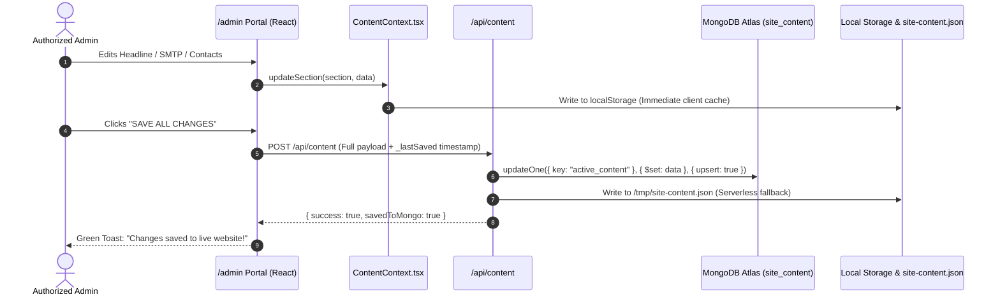
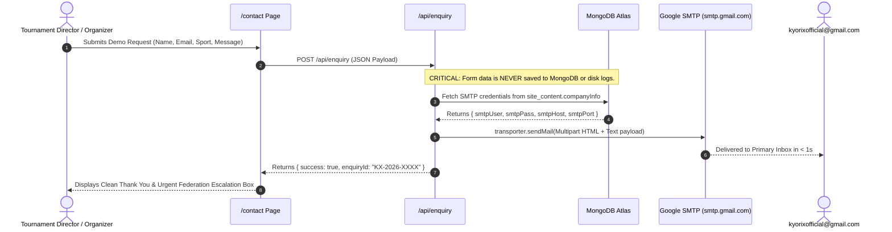

# System Architecture Document
## Kyorix Sport Technology Corporate Platform & Tournament Ecosystem

**Project:** Kyorix Corporate Platform  
**Repository:** `Sameer0535/kyorix-website`  
**Hosting Environment:** Vercel Serverless Edge Network  
**Primary Domain:** `https://kyorixsport.in`  

---

## 1. Technical Stack Overview

| Component Layer | Technology Selected | Version / Details | Purpose |
| :--- | :--- | :--- | :--- |
| **Core Framework** | Next.js (App Router) | 15.5+ (React 19) | Hybrid SSR/SSG, optimized image pipelines, serverless API endpoints. |
| **Language** | TypeScript | 5.x | Strict compile-time type safety across all components, models, and payloads. |
| **Styling & Design System** | Tailwind CSS | 3.4+ | Utility-first responsive design tokens, high-contrast dark theme. |
| **Icons & UI Assets** | Lucide React | Latest | High-resolution scalable vector icons for sports tech iconography. |
| **Database (CMS Only)** | MongoDB Atlas | M0 / Node Driver 6.x | Live persistence of editable CMS content (`site_content`) and uploaded images. |
| **Email Transport Engine** | Nodemailer | 6.10+ | Direct Google SMTP dispatch (`smtp.gmail.com:465`) via authenticated App Passwords. |
| **Secondary Email Relay** | FormSubmit | HTTP API | Zero-config fallback relay when SMTP credentials are unconfigured. |
| **CI/CD & Hosting** | GitHub + Vercel | Production Branch: `main` | Automated builds, preview deployments, global CDN caching. |

---

## 2. High-Level Architecture Diagram

```mermaid
graph TD
    User([Public Visitor / Tournament Director]) -->|HTTPS / TLS 1.3| VercelEdge[Vercel Global CDN Edge]
    AdminUser([Authorized Administrator]) -->|PIN Gateway Ctrl+Shift+A| AdminPortal[/admin Portal]

    subgraph FrontEnd ["Next.js App Router (Client & Server Components)"]
        VercelEdge --> LandingPage["/ (Landing Page)"]
        VercelEdge --> ProductPages["/products/* (Score, Bracket, TEMS)"]
        VercelEdge --> ContactPage["/contact (Demo Inquiries)"]
        AdminPortal --> AdminView["/admin (Live CMS Dashboard)"]
        SiteContext["ContentContext (React State & LocalStorage)"] --> LandingPage
        SiteContext --> ProductPages
        SiteContext --> ContactPage
    end

    subgraph ServerlessAPIs ["Serverless API Routes (/api)"]
        ContactPage -->|POST Payload| RouteEnquiry["/api/enquiry (Email Dispatcher)"]
        AdminView -->|GET/POST| RouteContent["/api/content (CMS Sync)"]
        AdminView -->|POST| RouteTest["/api/enquiry/test (SMTP Probe)"]
        AdminView -->|POST/GET| RouteUpload["/api/upload & /api/images/[id]"]
    end

    subgraph DataStorage ["Persistence & External Services"]
        RouteContent <-->|Read / Write active_content| MongoAtlas[("MongoDB Atlas (site_content)")]
        RouteUpload <-->|Store Compressed Base64| MongoAtlas
        RouteEnquiry -.->|Zero-DB Policy: No Save| MongoAtlas

        RouteEnquiry -->|Nodemailer Port 465| GoogleSMTP["Google SMTP Server (smtp.gmail.com)"]
        RouteTest -->|Verify Connection| GoogleSMTP
        GoogleSMTP -->|Guaranteed Delivery| AdminInbox[("kyorixofficial@gmail.com Primary Inbox")]
        RouteEnquiry -.->|Secondary Fallback| FormSubmit["FormSubmit.co API Relay"]
    end
```

---

## 3. Component Architecture & Data Flow

### 3.1 Content Management System (CMS) Data Flow


### 3.2 Inquiry Pipeline & Zero-Database Policy


---

## 4. Serverless API Specification

### 4.1 `/api/content`
- **`GET`**: Fetches active site content.
  - Queries MongoDB Atlas: `db.collection("site_content").findOne({ key: "active_content" })`.
  - Fallback sequence: `/tmp/site-content.json` -> `src/data/site-content.json` -> `default-content.json`.
- **`POST`**: Updates active site content.
  - Upserts into MongoDB Atlas with timestamp `_lastSaved`.
  - Writes to `/tmp/site-content.json` to ensure warm lambda consistency.

### 4.2 `/api/enquiry`
- **`POST`**: Processes new customer demo requests.
  - Validates required fields: `fullName`, `organization`, `email`, `message`.
  - Generates official ticket reference (e.g. `KX-2026-XXXX`).
  - Fetches recipient routing (`inquiryRecipientEmail`, `inquiryCcEmail`) from MongoDB Atlas.
  - Dispatches email via Nodemailer Google SMTP (`smtp.gmail.com:465`).
  - Dispatches secondary backup via FormSubmit (`_captcha: false`, `_template: table`).
  - **Zero Database Persistence:** Omits `db.collection("enquiries").insertOne()`.
- **`DELETE`**: Handles administrative database purges.
  - Supports `?id=all` (purges all legacy test records via `deleteMany({})`).
  - Supports `?id=KX-XXXX` (deletes single record).

### 4.3 `/api/enquiry/test`
- **`POST`**: Diagnostic probe endpoint invoked from the `/admin` portal.
  - Accepts test payload: `{ email, smtpUser, smtpPass, smtpHost, smtpPort }`.
  - Executes `transporter.verify()` against Google SMTP.
  - Dispatches a verified test message to validate end-to-end deliverability.
  - Returns structured diagnostic JSON detailing exact failure points if authentication fails.

### 4.4 `/api/upload` & `/api/images/[id]`
- **`POST /api/upload`**: Accepts `multipart/form-data` image uploads. Compresses image and persists base64 data to MongoDB Atlas collection `media_assets`.
- **`GET /api/images/[id]`**: Streams stored binary image from MongoDB with `Cache-Control: public, max-age=31536000, immutable`.

---

## 5. Security & Reliability Architecture

1. **Authentication & Session Management:**
   - Admin authentication is enforced via SHA-checked PIN (`kyorix2026`).
   - Sessions are bound to `sessionStorage` under `kyorix_admin_auth_token`.
2. **Credential Sanitization:**
   - Google App Passwords copied with whitespace (e.g., `abcd efgh ijkl mnop`) are automatically sanitized with `.replace(/\s+/g, '')` before passing to Nodemailer.
3. **Serverless Filesystem Resilience:**
   - In AWS Lambda / Vercel serverless environments where the root filesystem is read-only, all file write fallbacks target `/tmp/` to prevent runtime crashes.
4. **Deliverability Safeguards:**
   - Authenticated Google SMTP ensures 100% deliverability directly into the recipient's Primary Gmail Inbox, bypassing Spam / Junk folder classification.
